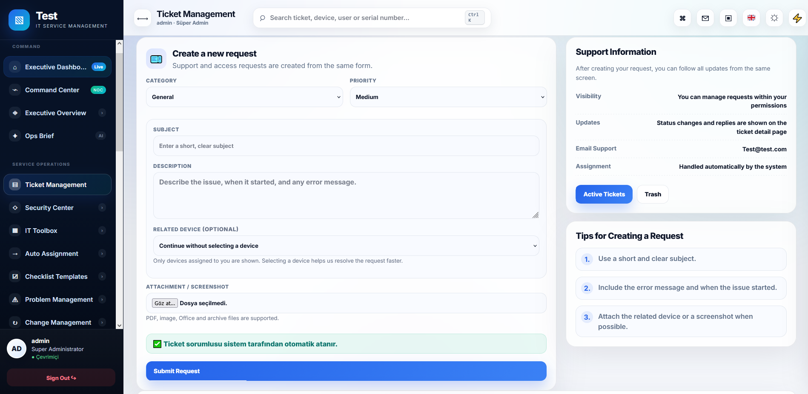
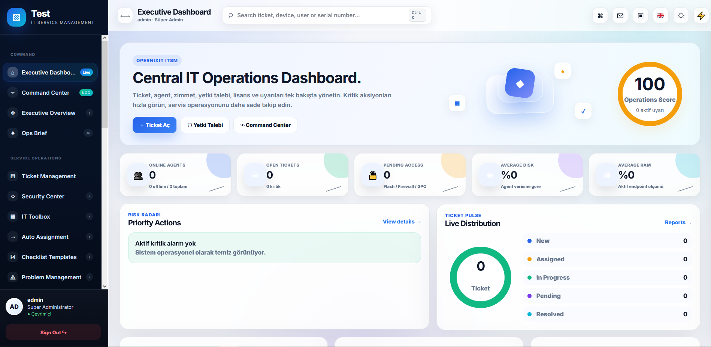

<div align="center">

# OpernixIT

### Free Self-Hosted IT Service Management Platform

Helpdesk, asset management, access workflows and endpoint operations in one centralized platform.

[](https://opernixit.com)
[](https://github.com/ShotLastS/OpernixITSM)
[](https://www.postgresql.org/)
[](#requirements)
[](#windows-server-installation)
[](#features)

</div>

---

> [!IMPORTANT]
> This repository contains the public deployment files for OpernixIT.
>
> The application source code is maintained in a private repository. The ready-to-use Docker image is publicly distributed through GitHub Container Registry.

## About OpernixIT

OpernixIT is a free, self-hosted IT management platform designed for internal IT departments, system administrators and technical support teams.

It combines helpdesk operations, asset lifecycle management, access request workflows, endpoint monitoring and operational reporting in a single interface.

OpernixIT runs entirely on your own infrastructure, allowing you to retain control over application data, uploaded files and system configuration.

## Features

### Helpdesk and Ticket Management

- Ticket creation, assignment and tracking
- Ticket priorities, categories and status workflows
- SLA tracking
- Critical ticket management
- Internal notes and file attachments
- E-mail-to-ticket support
- Ticket activity history
- Automatic ticket assignment

### Asset Management

- Hardware and software inventory
- Asset assignment and return workflows
- Warranty and purchase information
- QR-supported asset records
- Inventory count operations
- Asset change history
- License tracking
- Assignment PDF generation

### Access Request Workflows

- Service catalog
- Access and authorization requests
- Approval workflows
- Department-based visibility
- Request status tracking
- Audit history

### Endpoint Operations

- Windows endpoint agent
- CPU, memory and disk information
- Device name, IP address and domain information
- Online and offline endpoint status
- Last-seen tracking
- Device inventory synchronization

### IT Operations

- Problem management
- Change management
- Release management
- Knowledge base
- Notifications
- Operational reports
- Audit logs
- Scheduled reminders
- Network topology management

### Platform Features

- English and Turkish interface
- Dark and light themes
- PostgreSQL support
- SQLite support for local testing
- Docker deployment
- Persistent application storage
- Initial setup wizard
- Self-hosted architecture

## Interface

### Executive Dashboard

<p align="center">
  
</p>

### Ticket and Operations Dashboard

<p align="center">
  
</p>

## Architecture

```text
Users
  │
  ▼
OpernixIT Web Application
  │
  ├── PostgreSQL Database
  ├── Persistent Runtime Configuration
  ├── Persistent Upload Storage
  ├── E-mail and Notification Services
  └── Windows Endpoint Agents
```

The Docker deployment contains two main services:

| Service | Description |
|---|---|
| `app` | OpernixIT web application |
| `db` | PostgreSQL 16 database |

Application configuration, uploaded files and PostgreSQL data are stored in persistent Docker volumes.

## Requirements

Recommended minimum server requirements:

- Linux server
- 2 CPU cores
- 4 GB RAM
- 20 GB free disk space
- Docker Engine 24 or newer
- Docker Compose v2
- Network access to `ghcr.io`

For production environments:

- Static IP address or DNS record
- HTTPS reverse proxy
- Regular PostgreSQL backups
- SMTP account for outgoing notifications

## Quick Installation

### 1. Clone the Deployment Repository

```bash
git clone https://github.com/OpernixIT/OpernixITSM.git
cd OpernixITSM
```

### 2. Create the Environment File

```bash
cp .env.example .env
```

Open the environment file:

```bash
nano .env
```

Example configuration:

```env
OPERNIXIT_IMAGE=ghcr.io/shotlasts/opernixit
OPERNIXIT_VERSION=1.0.0
OPERNIXIT_PORT=5000

POSTGRES_DB=opernixit
POSTGRES_USER=opernixit
POSTGRES_PASSWORD=CHANGE_WITH_A_LONG_RANDOM_PASSWORD

TZ=Europe/Istanbul
```

> [!WARNING]
> Do not include a version tag in `OPERNIXIT_IMAGE`.
>
> Correct:
>
> ```env
> OPERNIXIT_IMAGE=ghcr.io/opernixit/opernixit
> OPERNIXIT_VERSION=1.0.0
> ```
>
> Incorrect:
>
> ```env
> OPERNIXIT_IMAGE=ghcr.io/opernixit/opernixit:latest
> OPERNIXIT_VERSION=1.0.0
> ```

### 3. Pull the Container Images

```bash
docker compose pull
```

### 4. Start OpernixIT

```bash
docker compose up -d
```

Check the service status:

```bash
docker compose ps
```

Expected result:

```text
opernixit-app    Up
opernixit-db     Up (healthy)
```

### 5. Open the Setup Wizard

Open the following address in your browser:

```text
http://SERVER-IP:5000/setup
```

Example:

```text
http://192.168.1.50:5000/setup
```

## Initial Setup

During the first setup, select PostgreSQL and enter:

| Field | Value |
|---|---|
| Database type | PostgreSQL |
| Host | `db` |
| Port | `5432` |
| Database name | Value of `POSTGRES_DB` |
| Database user | Value of `POSTGRES_USER` |
| Database password | Value of `POSTGRES_PASSWORD` |

> [!IMPORTANT]
> Use `db` as the PostgreSQL host.
>
> Do not use `localhost`, `127.0.0.1` or the physical server IP address. The application connects to PostgreSQL through the internal Docker network.

You will also configure:

- System name
- Company name
- Support e-mail address
- Default language
- Super administrator username
- Super administrator password
- HTTPS preference

After completing the setup wizard, the runtime configuration is stored in the persistent `opernixit_config` Docker volume.

## Updating OpernixIT

OpernixIT uses versioned container images.

To update to a new release, edit `.env`:

```env
OPERNIXIT_VERSION=1.0.1
```

Then run:

```bash
docker compose pull
docker compose up -d
```

Check the running services:

```bash
docker compose ps
```

View the application logs:

```bash
docker compose logs --tail=100 app
```

### Using the Latest Release

For testing environments, you can use:

```env
OPERNIXIT_VERSION=latest
```

Then update with:

```bash
docker compose pull
docker compose up -d
```

For production systems, a fixed version such as `1.0.0` or `1.0.1` is recommended.

## Useful Commands

### Show Running Services

```bash
docker compose ps
```

### View Application Logs

```bash
docker compose logs -f app
```

### View PostgreSQL Logs

```bash
docker compose logs -f db
```

### Restart the Application

```bash
docker compose restart app
```

### Restart All Services

```bash
docker compose restart
```

### Stop OpernixIT

```bash
docker compose down
```

### Start OpernixIT Again

```bash
docker compose up -d
```

### Pull the Latest Configured Version

```bash
docker compose pull
```

### Inspect the Resolved Configuration

```bash
docker compose config
```

> [!CAUTION]
> Never run:
>
> ```bash
> docker compose down -v
> ```
>
> The `-v` option removes persistent Docker volumes and may permanently delete the PostgreSQL database, uploaded files and runtime configuration.

## Persistent Volumes

The deployment uses the following volumes:

| Volume | Purpose |
|---|---|
| `opernixit_postgres` | PostgreSQL database |
| `opernixit_config` | Runtime application configuration |
| `opernixit_uploads` | Uploaded files and attachments |

List the volumes:

```bash
docker volume ls | grep opernixit
```

## Backup

### Create a PostgreSQL Backup

```bash
docker compose exec -T db \
  pg_dump -U opernixit -d opernixit \
  > opernixit-backup.sql
```

### Restore a PostgreSQL Backup

```bash
cat opernixit-backup.sql | \
docker compose exec -T db \
  psql -U opernixit -d opernixit
```

### Back Up Persistent Volumes

Back up the database, runtime configuration and uploaded files regularly.

Store backup copies outside the OpernixIT server whenever possible.


## Windows Server Installation

OpernixIT can also be installed directly on Windows without Docker.

The Windows installer installs OpernixIT as a Windows service, configures automatic startup, creates the required runtime folders and opens the initial setup wizard.

### Supported Systems

- Windows 10 64-bit
- Windows 11 64-bit
- Windows Server 2019 or newer
- Administrator privileges

### 1. Download the Installer

Download:

```text
OpernixIT-Setup.exe
```

Use only the official OpernixIT website or the official GitHub Releases page.

### 2. Run the Installer as Administrator

Right-click:

```text
OpernixIT-Setup.exe
```

Select:

```text
Run as administrator
```

> [!WARNING]
> **Windows SmartScreen Notice**
>
> The current OpernixIT Windows installer is signed with a self-signed certificate.
> Windows may display **Windows protected your PC** or **Unknown publisher**.
>
> To continue:
>
> 1. Click **More info**
> 2. Click **Run anyway**
>
> Only download OpernixIT from:
>
> - [https://opernixit.com](https://opernixit.com)
> - [https://github.com/ShotLastS/OpernixITSM](https://github.com/ShotLastS/OpernixITSM)

### 3. Complete the Setup Wizard

The installer will:

- Install OpernixIT under `C:\Program Files\OpernixIT`
- Create the `OpernixIT` Windows service
- Configure delayed automatic startup
- Restart the service automatically after failures
- Create persistent configuration, upload and log folders
- Start OpernixIT on port `5000`
- Open the initial setup page

The persistent data folders are:

```text
C:\ProgramData\OpernixIT\config
C:\ProgramData\OpernixIT\uploads
C:\ProgramData\OpernixIT\logs
```

### 4. Open the Initial Setup Page

The installer opens:

```text
http://localhost:5000/setup
```

To open OpernixIT from another computer on the network, use:

```text
http://WINDOWS-SERVER-IP:5000/setup
```

Example:

```text
http://192.168.1.50:5000/setup
```

### 5. Configure the Database

For a quick local installation, select:

```text
SQLite
```

SQLite stores the database inside:

```text
C:\ProgramData\OpernixIT\config
```

For production environments, PostgreSQL is recommended.

When using PostgreSQL, enter:

| Field | Value |
|---|---|
| Database Type | PostgreSQL |
| Host | PostgreSQL server IP or hostname |
| Port | `5432` |
| Database Name | Your PostgreSQL database name |
| Database User | Your PostgreSQL username |
| Database Password | Your PostgreSQL password |

> [!IMPORTANT]
> The Windows installer does not install PostgreSQL automatically.
>
> PostgreSQL must already be installed on the same Windows server or on another reachable server before selecting PostgreSQL in the setup wizard.

### 6. Create the Administrator Account

Complete the remaining fields:

- System name
- Company name
- Support e-mail address
- Default language
- Super administrator username
- Super administrator password
- HTTPS preference

After completing the wizard, open:

```text
http://localhost:5000
```

or from another computer:

```text
http://WINDOWS-SERVER-IP:5000
```

## Windows Service Management

### Check the Service

Open PowerShell as Administrator:

```powershell
Get-Service OpernixIT
```

Expected status:

```text
Running
```

### Start the Service

```powershell
Start-Service OpernixIT
```

### Stop the Service

```powershell
Stop-Service OpernixIT
```

### Restart the Service

```powershell
Restart-Service OpernixIT
```

You can also manage the service from:

```text
services.msc
```

Service name:

```text
OpernixIT
```

Display name:

```text
OpernixIT Service
```

## Windows Logs

Standard service log:

```text
C:\ProgramData\OpernixIT\logs\opernixit-service.log
```

Error log:

```text
C:\ProgramData\OpernixIT\logs\opernixit-service-error.log
```

Read the latest error entries:

```powershell
Get-Content "C:\ProgramData\OpernixIT\logs\opernixit-service-error.log" -Tail 100
```

## Windows Firewall

OpernixIT listens on TCP port `5000`.

To allow access from other computers, run PowerShell as Administrator:

```powershell
New-NetFirewallRule -DisplayName "OpernixIT TCP 5000" -Direction Inbound -Protocol TCP -LocalPort 5000 -Action Allow
```

Verify that the port is listening:

```powershell
Get-NetTCPConnection -LocalPort 5000 -State Listen
```

## Windows Update

Before updating, back up:

```text
C:\ProgramData\OpernixIT
```

Run the newer `OpernixIT-Setup.exe` as Administrator and install it over the existing installation.

Leave **Fresh installation** unchecked to preserve the existing runtime configuration.

> [!CAUTION]
> Selecting **Fresh installation** resets the active setup files.
>
> Existing setup files are moved into a timestamped backup folder under:
>
> ```text
> C:\ProgramData\OpernixIT
> ```

## Windows Uninstallation

Open:

```text
Settings
→ Apps
→ Installed apps
→ OpernixIT
→ Uninstall
```

The uninstaller removes the OpernixIT Windows service and application files.

Back up the following folder before uninstalling when data must be preserved:

```text
C:\ProgramData\OpernixIT
```


## Windows Agent

The Windows endpoint agent collects device inventory and system health information and sends it to the OpernixIT server.

The agent can collect:

- Computer name
- Logged-in user
- IP address
- Domain information
- CPU information
- Memory information
- Disk capacity and usage
- Operating system information
- Last-seen status

### Agent Installation

Run PowerShell as Administrator:

```powershell
Set-ExecutionPolicy Bypass -Scope Process
```

Install the agent:

```powershell
.\scripts\install-agent.ps1 `
  -PackageUrl "https://YOUR-DOWNLOAD-ADDRESS/OpernixITAgent-1.0.0.zip" `
  -ServerUrl "https://YOUR-OPERNIXIT-SERVER" `
  -AgentKey "YOUR-AGENT-KEY"
```

The installation script:

- Installs the agent under `C:\Program Files\OpernixIT Agent`
- Creates the `OpernixITAgent` Windows service
- Enables delayed automatic startup
- Configures automatic service recovery
- Creates the agent configuration file
- Stores local service logs

Check the service:

```powershell
Get-Service OpernixITAgent
```

Restart the service:

```powershell
Restart-Service OpernixITAgent
```

Read the agent error log:

```powershell
Get-Content "C:\Program Files\OpernixIT Agent\agent-service-error.log" -Tail 100
```

## Active Directory Deployment

The OpernixIT Windows Agent can be distributed through Group Policy in Active Directory environments.

Recommended deployment method:

1. Store the agent package on a protected internal file share.
2. Grant domain computers read-only access.
3. Store the PowerShell installation script in a controlled deployment directory.
4. Open Group Policy Management.
5. Navigate to:

```text
Computer Configuration
└── Windows Settings
    └── Scripts
        └── Startup
```

6. Add the agent installation script.
7. Test the policy on a limited organizational unit before domain-wide deployment.
8. Use HTTPS for communication with the OpernixIT server.
9. Rotate agent keys periodically.

Never publish agent keys, API keys or credentials in a public repository.

## Reverse Proxy and HTTPS

For production deployments, place OpernixIT behind a reverse proxy such as:

- Nginx
- Caddy
- Traefik
- IIS Application Request Routing

The reverse proxy should forward traffic to:

```text
http://127.0.0.1:5000
```

Recommended public address:

```text
https://itsm.example.com
```

Enable the HTTPS option in the setup wizard only after HTTPS has been configured correctly.

## Security Recommendations

- Change all default passwords.
- Use a long and unique PostgreSQL password.
- Never commit the `.env` file.
- Never publish administrator credentials.
- Never publish agent keys.
- Use HTTPS in production.
- Restrict access to port `5000`.
- Keep PostgreSQL available only through the Docker network.
- Back up PostgreSQL regularly.
- Use fixed image versions in production.
- Review application and audit logs.
- Keep Docker and the host operating system updated.

## Repository Structure

```text
OpernixITSM/
├── README.md
├── .env.example
├── docker-compose.yml
├── docs/
│   └── img/
│       ├── dashboard.png
│       └── dashboard2.png
└── scripts/
    ├── install-agent.ps1
    └── update-opernixit.sh
```

## Troubleshooting

### Image Reference Is Invalid

Error:

```text
invalid reference format
```

Check `.env`:

```env
OPERNIXIT_IMAGE=ghcr.io/shotlasts/opernixit
OPERNIXIT_VERSION=1.0.0
```

Do not include `:latest` or another tag in `OPERNIXIT_IMAGE`.

### Container Image Cannot Be Pulled

Test the image directly:

```bash
docker pull ghcr.io/shotlasts/opernixit:1.0.0
```

Check the resolved Compose configuration:

```bash
docker compose config | grep image
```

### Application Container Is Restarting

Check the logs:

```bash
docker compose logs --tail=150 app
```

### PostgreSQL Is Not Ready

Check the database status:

```bash
docker compose ps
docker compose logs --tail=100 db
```

### Port 5000 Is Already in Use

Change the public port in `.env`:

```env
OPERNIXIT_PORT=5050
```

Then restart:

```bash
docker compose up -d
```

Open:

```text
http://SERVER-IP:5050
```

## Links

- Website: [opernixit.com](https://opernixit.com)
- Deployment repository: [github.com/ShotLastS/OpernixITSM](https://github.com/ShotLastS/OpernixITSM)
- English documentation: [opernixit.com/en/documentation](https://opernixit.com/en/documentation/)
- Turkish documentation: [opernixit.com/tr/documentation](https://opernixit.com/tr/documentation/)
- Contact: [info@opernixit.com](mailto:info@opernixit.com)

## Support

For bug reports, deployment assistance and general questions:

```text
info@opernixit.com
```

When requesting technical support, include:

- OpernixIT version
- Linux distribution
- Docker version
- Docker Compose version
- Relevant application logs
- Relevant database logs

Do not include passwords, tokens, agent keys or confidential company data.

## License and Distribution

OpernixIT is free-to-use, self-hosted proprietary software.

This repository contains deployment and installation files only. It does not include the OpernixIT application source code.

The following actions are prohibited unless explicitly authorized:

- Redistributing the OpernixIT application image
- Reselling OpernixIT
- Repackaging the application under another name
- Reverse engineering
- Removing OpernixIT branding
- Claiming ownership of the software

See the repository license file for complete terms.

---

<div align="center">

### Built for Modern IT Operations

**Helpdesk · Assets · Endpoints · Access Workflows · Reporting**

[Website](https://opernixit.com) · [Documentation](https://opernixit.com/en/documentation/) · [Contact](mailto:info@opernixit.com)

</div>
[!WARNING]
>Z<3E
